# 1. 入门篇：Mermaid 语法基础

Mermaid 是一个基于 JavaScript 的图表绘制工具，它通过类似于 Markdown 的文本语法来渲染复杂的图表。由于其轻量级、版本控制友好以及与 Markdown 的深度集成，Mermaid 已成为技术文档中流程图、时序图和甘特图的首选方案。

## 1.1 核心概念与渲染机制

Mermaid 的核心思想是“通过文本生成图表”。它将图形的逻辑结构抽象为代码，并在渲染时由浏览器或编辑器插件实时将其转换为 SVG 矢量图形。

### 1.1.1 什么是 Mermaid 语法
Mermaid 语法是一种声明式语言。这意味着你只需要描述“图表由哪些节点组成”以及“节点之间如何连接”，而无需手动设定每个元素在画布上的精确坐标。Mermaid 引擎会自动处理布局算法，确保生成的图形整洁且逻辑清晰。

### 1.1.2 在 Markdown 中的渲染方式
要让 Markdown 编辑器正确渲染 Mermaid 图表，必须使用特定的代码块语法。所有 Mermaid 代码都必须包裹在以 `mermaid` 标识的代码块中：

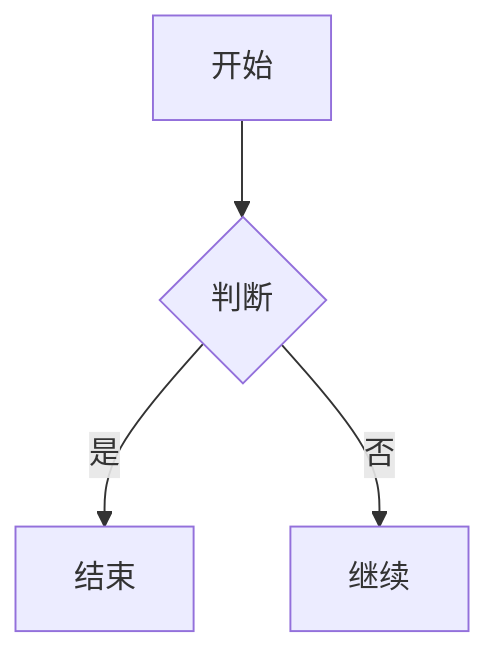

大多数主流 Markdown 编辑器（如 Obsidian、Typora、VS Code 的 Markdown 预览插件等）都内置了对 Mermaid 的支持。如果你的编辑器无法渲染，请检查插件是否已安装或启用。

## 1.2 流程图（Flowchart）基本结构

流程图是 Mermaid 最常用的功能。通过 `graph` 关键字，我们可以定义图表的流向和节点关系。

### 1.2.1 定义方向
在定义流程图时，首先需要指定图表的渲染方向：

- `TD` (Top-Down): 从上到下（默认）
- `BT` (Bottom-Top): 从下到上
- `LR` (Left-Right): 从左到右
- `RL` (Right-Left): 从右到左

例如，创建一个从左到右的流程：


### 1.2.2 节点定义与形状
Mermaid 支持多种节点形状，通过不同的括号语法实现：

1. `[矩形]`：标准节点
2. `([圆角矩形])`：圆角节点
3. `[[子程序]]`：双边框节点
4. `[(数据库)]`：圆柱形节点
5. `{菱形}`：判断节点

以下是一个综合示例：

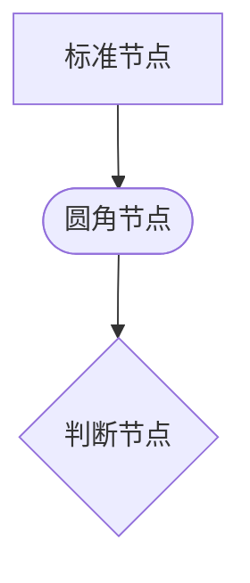

## 1.3 连接线语法

连接线是连接图表中各个节点的纽带，Mermaid 提供了多种连接线样式来表达不同的业务逻辑。

### 1.3.1 基础连线
- `-->`：带箭头的实线（标准流向）
- `---`：不带箭头的实线（简单关联）
- `-.->`：带箭头的虚线（非必要或可选路径）
- `==>`：加粗实线（强调路径）

### 1.3.2 带文字的连线
在连线中添加描述信息，可以增强图表的易读性。语法格式为在连接符号中添加文字，例如 `-->|文字|`：

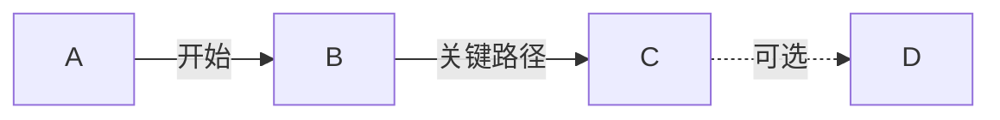

通过掌握上述基础语法，你已经具备了构建简单逻辑流程图的能力。在后续章节中，我们将进一步探索如何通过样式配置和高级属性来美化并完善这些图表。

---

# 2. 基础流程图：从线性到分支

## 2.1 流程图的定义与语法基础

Mermaid 通过 `flowchart` 关键字开启流程图的绘制。流程图由节点（Node）和连接线（Link）组成，定义方式简洁直观。在代码块中，只需声明方向（如 `TD` 表示从上到下，`LR` 表示从左到右），即可构建起逻辑骨架。

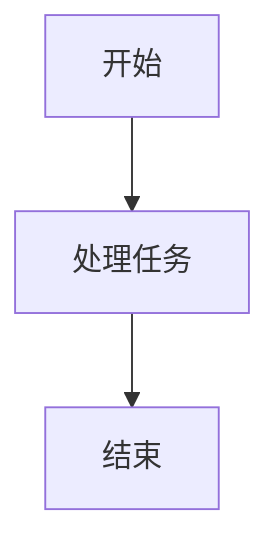

在上述代码中，`A` 和 `B` 是节点的 ID，方括号 `[]` 用于定义节点的形状，而 `-->` 则定义了从 A 指向 B 的线性流程。

## 2.2 节点样式与形状设置

Mermaid 支持多种节点形状，以表达不同的逻辑含义，如决策、输入输出、存储等。节点形状由包裹文本的符号决定。

### 2.2.1 常用节点形状
- `[文本]`：矩形节点（默认）
- `([文本])`：圆角矩形节点
- `[[文本]]`：子程序节点
- `[(文本)]`：数据库存储节点
- `{文本}`：菱形决策节点
- `((文本))`：圆形节点

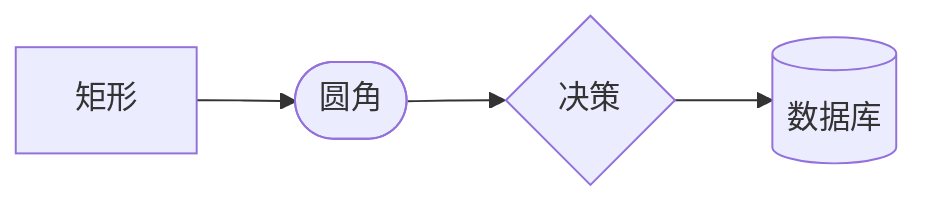

## 2.3 连接线的表现形式

连接线不仅是简单的箭头，还可以通过不同的符号组合来表达特定的逻辑关系，如无向连接、双向连接、加粗线条或虚线。

### 2.3.1 连接线类型
- `---`：无箭头直线
- `-->`：带箭头直线
- `-.->`：虚线箭头
- `==>`：加粗箭头
- `---o`：连接端带圆圈
- `==x`：连接端带叉号

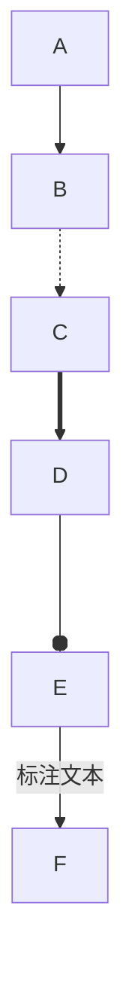

在连接线中间，可以通过 `--- 文本 ---` 的格式为连线添加说明文字，这在描述条件流转时非常有用。

## 2.4 从线性流向分支逻辑

当流程不再单一，需要根据条件进行分流时，通常使用菱形节点作为判断点。通过在不同的连线上标注条件，可以清晰地展示业务逻辑的分支路径。

### 2.4.1 实现条件判断
分支结构的核心在于从决策节点引出多条连线，每条连线标注不同的逻辑分支（如“是”或“否”）。

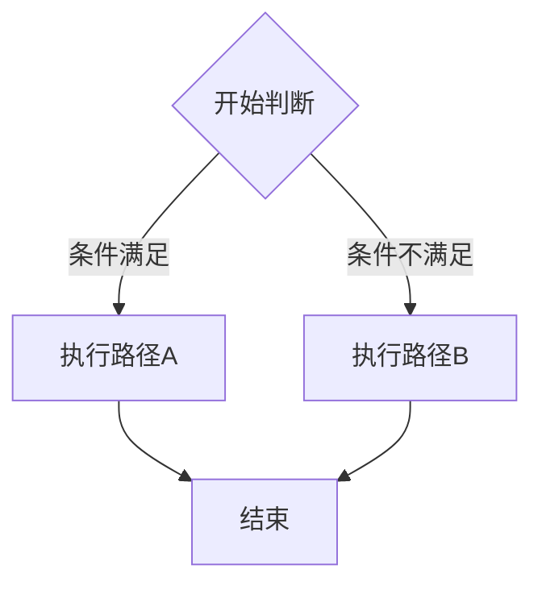

通过这种方式，即使是复杂的业务流程，也能被拆解为可读性极高的图形化逻辑，从而实现从简单的线性逻辑到复杂多分支逻辑的平滑过渡。

---

# 3. 时序图进阶：交互与逻辑可视化

时序图（Sequence Diagram）是描述对象之间交互顺序的强大工具。通过对生命线、消息类型及控制逻辑的精确控制，我们可以将复杂的系统行为转化为清晰的可视化文档。

## 3.1 参与者生命线与别名管理

在复杂的交互中，参与者（Participants）不仅是简单的文本标签。我们可以通过定义别名（Alias）来简化代码编写，并利用 `participant` 关键字明确对象的类型或顺序。

### 3.1.1 定义参与者类型
除了默认的参与者，Mermaid 允许使用不同的形状来增强语义表达，例如 `actor`（人形图标）或 `boundary`（边界对象）。

```mermaid
sequenceDiagram
    actor User as 用户
    participant S as 服务器
    boundary DB as 数据库
    
    User->>S: 发送请求
    S->>DB: 查询数据
```

### 3.1.2 生命线的销毁与创建
在资源管理场景中，显示对象的生命周期至关重要。使用 `activate` 和 `deactivate` 可以控制激活条，而 `destroy` 则用于标记对象的生命周期终结。

## 3.2 消息类型的语义化表达

时序图中的箭头不仅代表方向，还代表通信的性质。合理使用不同类型的箭头能够显著提升图表的可读性。

- `->>` : 实线箭头，表示同步消息。
- `-->` : 虚线箭头，表示返回消息（Response）。
- `->>+` : 带激活条的同步消息，自动进入激活状态。
- `-->>-` : 带销毁激活条的返回消息。

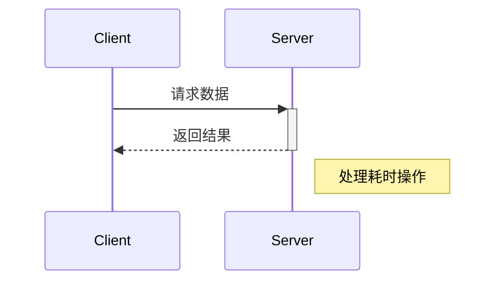

## 3.3 激活条与嵌套交互

激活条（Activation Bar）用于表示对象处于处理状态的时间段。当一个对象调用自身或嵌套调用其他对象时，激活条的叠加显示能清晰反映调用栈。

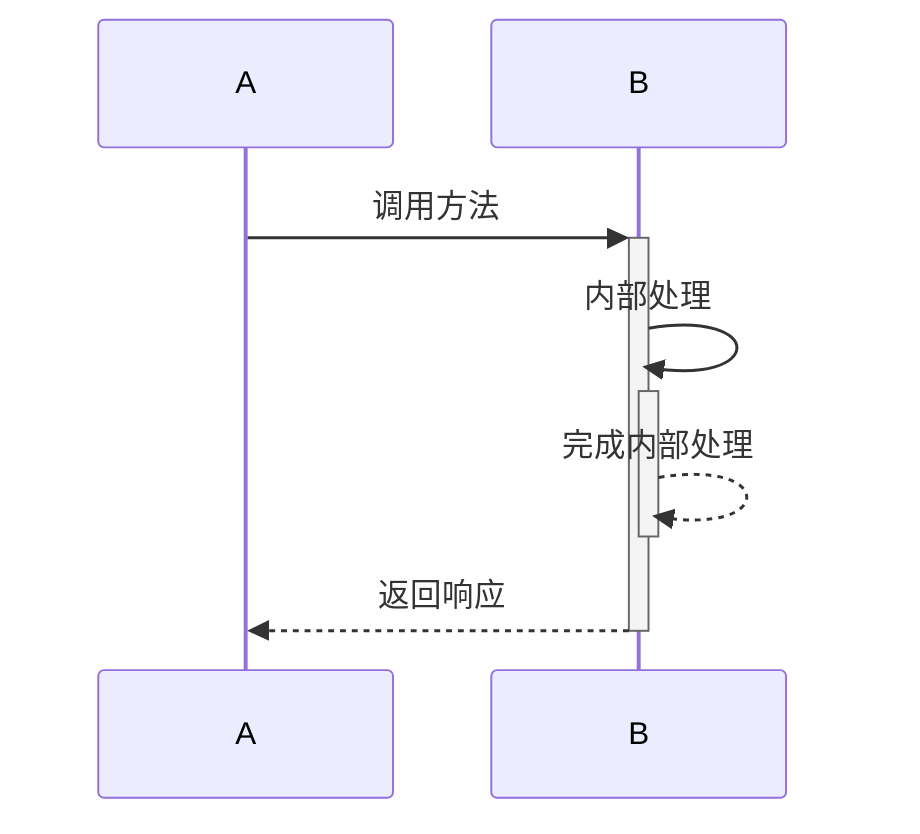

## 3.4 逻辑控制框（Interaction Fragments）

为了在时序图中体现逻辑判断、循环和并行处理，Mermaid 提供了分组框功能。

### 3.4.1 条件与选择结构
使用 `alt/else` 块描述 if-else 分支，使用 `opt` 块描述可选行为。

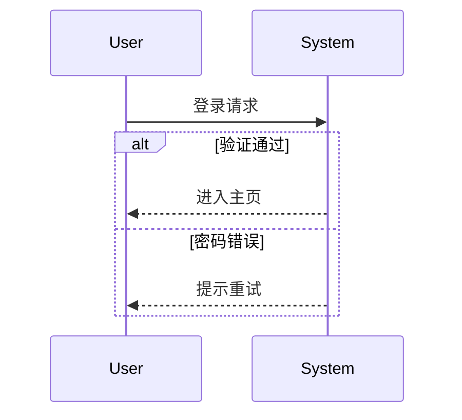

### 3.4.2 循环与并行结构
- `loop`: 用于描述重复发生的交互。
- `par`: 用于描述同时进行的多个并发动作。
- `rect`: 用于对一组逻辑进行背景高亮，提升视觉分类效果。

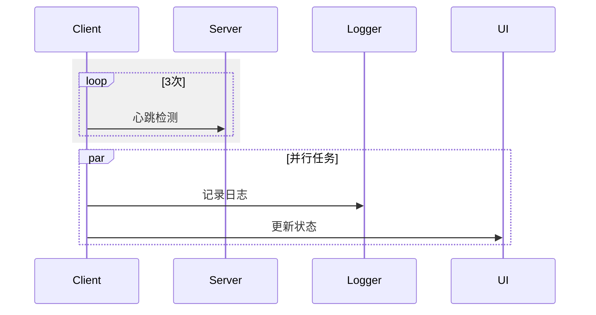

---

# 4. 类图设计：面向对象的结构表达

类图（Class Diagram）是统一建模语言（UML）中最常用的图表之一，用于描述系统的静态结构。在 Mermaid 中，通过 `classDiagram` 语法，我们可以清晰地定义类、属性、方法以及它们之间的逻辑关系。

## 4.1 定义类与基础成员

在 Mermaid 类图中，定义一个类最简单的方式是使用 `class` 关键字。属性和方法可以通过大括号 `{}` 括起来，置于类名之后。

### 4.1.1 属性与方法的语法

属性和方法的定义格式为：`类型 成员名称`。为了区分访问权限，Mermaid 支持使用特定的符号前缀：

- `+`：Public（公有）
- `-`：Private（私有）
- `#`：Protected（受保护）
- `~`：Package/Internal（包内可见）

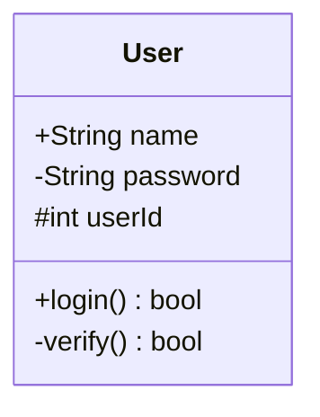

## 4.2 接口与抽象类

在面向对象设计中，接口和抽象类是实现多态和约束行为的关键。在 Mermaid 类图中，可以通过 `<>` 和 `<>` 构造型（Stereotype）来声明。

### 4.2.1 声明规范

- **接口**：定义一组行为契约，通常只包含方法签名。
- **抽象类**：包含部分实现，且不能被实例化。

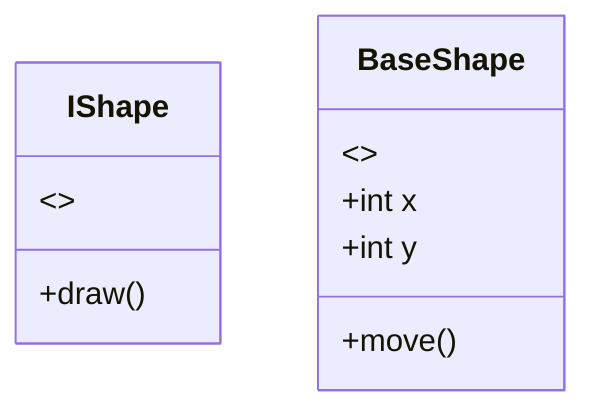

## 4.3 类之间的关系表达

类图的核心在于表达类与类之间的协作与约束。Mermaid 提供了丰富的箭头语法来表示这些关系。

### 4.3.1 继承与实现

- **继承（Inheritance）**：使用 `<|--` 表示子类继承父类。
- **实现（Realization）**：使用 `<|..` 表示类实现接口。

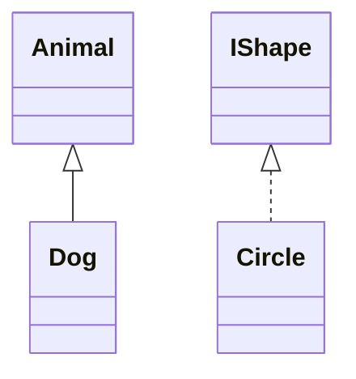

### 4.3.2 关联关系

关联关系表示两个类之间存在连接，可以使用不同的线型表示语义差异：

1. **组合（Composition）**：`*--` 表示强所属关系，整体销毁则部分销毁。
2. **聚合（Aggregation）**：`o--` 表示弱所属关系，部分可以独立于整体存在。
3. **关联（Association）**：`-->` 表示简单的单向引用。
4. **依赖（Dependency）**：`<..` 表示一个类在运行过程中需要另一个类的辅助。

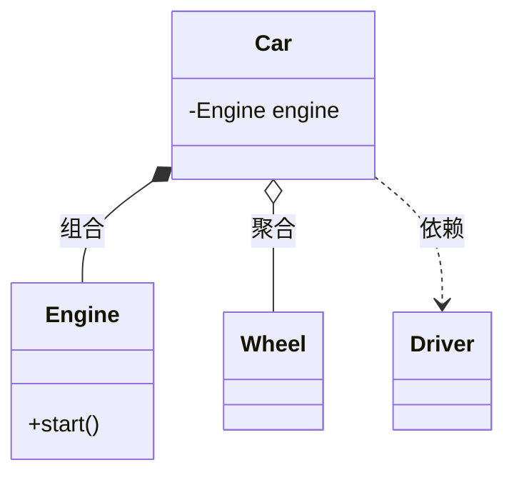

## 4.4 高级布局与注释

为了使类图更加易读，Mermaid 支持在关系线上添加标签，并允许通过注释对复杂的类进行说明。

### 4.4.1 关系标签与方向控制

可以在连线上添加文字说明，描述关系的具体含义。同时，可以通过 `direction` 指令控制图表的渲染方向（如 TB 从上到下，LR 从左到右）。

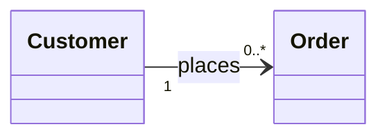

### 4.4.2 备注（Note）

使用 `note` 关键字可以为特定的类添加补充信息，这对解释设计模式或复杂逻辑非常有帮助。

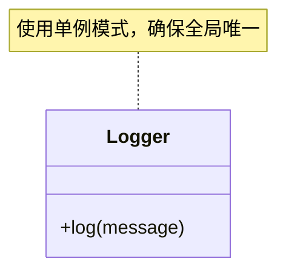

---

# 5. 状态图与生命周期管理

状态图（State Diagram）是描述对象在其生命周期内所经历的状态序列，以及导致状态转换的事件。在Mermaid中，状态图能够清晰地展现系统的业务逻辑流转，特别适用于订单处理、审批流程或硬件控制等具有明确阶段性的场景。

## 5.1 状态图基础语法

状态图的核心元素包括状态（State）、转换（Transition）、起始状态（[*]）以及结束状态（[*]）。

### 5.1.1 定义简单状态转换
在Mermaid中，使用 `stateDiagram-v2` 关键字定义图表。状态之间的转换通过 `-->` 符号表示。

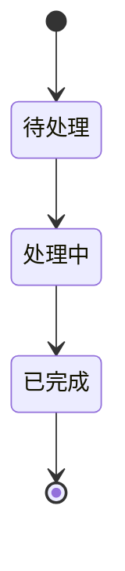

### 5.1.2 状态描述与注释
可以通过冒号 `:` 为转换过程添加描述文字，帮助阅读者理解触发转换的原因。

- 状态名：推荐使用英文字符或下划线，若需使用中文，建议保持简洁。
- 转换标签：用于说明事件触发条件。

```mermaid
stateDiagram-v2
    [*] --> 离线
    离线 --> 在线 : 连接网络
    在线 --> 离线 : 断开连接
```

## 5.2 复合状态与嵌套逻辑

当系统状态内部还包含更细致的逻辑分支时，复合状态（Composite States）是最佳选择。通过大括号 `{}` 将子状态包裹在内。

### 5.2.1 嵌套状态结构
复合状态可以有效地隐藏复杂性，将大系统拆解为若干子系统。

```mermaid
stateDiagram-v2
    [*] --> 运行中
    state 运行中 {
        [*] --> 待机
        待机 --> 工作中 : 接收任务
        工作中 --> 待机 : 任务完成
    }
    运行中 --> 关机
```

### 5.2.2 状态的选择与判断
使用 `<>` 来表示分支判断，类似于流程图中的菱形节点，用于根据条件进入不同的路径。

```mermaid
stateDiagram-v2
    [*] --> 检查账户
    state 检查账户 <>
    检查账户 --> 余额充足 : 余额 > 0
    检查账户 --> 余额不足 : 余额 <= 0
    余额充足 --> 交易成功
    余额不足 --> 拒绝交易
```

## 5.3 并发处理逻辑

在复杂的生命周期管理中，系统可能同时处于多个并行的活动状态。Mermaid通过双横线 `--` 实现并发状态的描述。

### 5.3.1 并行状态的定义
并发状态允许对象在同一时刻拥有多个独立的活动路径，这些路径在合并点汇合。

```mermaid
stateDiagram-v2
    state 并发任务 {
        [*] --> 传感器读取
        传感器读取 --> [*]
        --
        [*] --> 数据记录
        数据记录 --> [*]
    }
```

### 5.3.2 叉入与叉出（Fork/Join）
在高级模型中，可以使用并发条来表示多个分支的同步开始与结束。

- 叉入（Fork）：一个状态分解为多个并行状态。
- 叉出（Join）：多个并行状态合并为一个后续状态。

```mermaid
stateDiagram-v2
    [*] --> 准备
    state fork_state <>
    准备 --> fork_state
    fork_state --> 任务A
    fork_state --> 任务B
    
    state join_state <>
    任务A --> join_state
    任务B --> join_state
    join_state --> 汇总
    汇总 --> [*]
```

---

# 6. 甘特图：项目进度与时间规划

甘特图（Gantt Chart）是项目管理中最直观的工具，用于展示项目进度、任务周期以及任务之间的依赖关系。Mermaid 的甘特图语法简洁高效，能够快速将复杂的项目计划转化为清晰的可视化图表。

## 6.1 甘特图基础结构

一个标准的 Mermaid 甘特图由 `gantt` 关键字开启，并通过 `dateFormat` 定义日期格式，`axisFormat` 定义时间轴刻度显示格式。

```mermaid
gantt
    title 项目开发进度表
    dateFormat  YYYY-MM-DD
    axisFormat  %m-%d

    section 需求分析
    需求调研       :a1, 2023-10-01, 5d
    需求评审       :after a1, 3d
```

- `title`: 设置图表标题。
- `dateFormat`: 定义代码中使用的日期格式（如 YYYY-MM-DD）。
- `axisFormat`: 定义显示在图表底部的日期刻度格式（如 %m-%d 表示月-日）。
- `section`: 将任务按阶段分组。

## 6.2 任务依赖与里程碑设置

在项目管理中，任务往往存在先后逻辑。Mermaid 使用任务 ID 和 `after` 关键字来表达依赖关系，并使用 `milestone` 关键字标记关键节点。

### 6.2.1 任务依赖关系
通过指定任务 ID，可以确保任务按序排布：

```mermaid
gantt
    dateFormat  YYYY-MM-DD
    section 开发阶段
    前端开发    :dev1, 2023-10-10, 10d
    后端开发    :dev2, 2023-10-10, 12d
    接口联调    :after dev1 dev2, 5d
```

### 6.2.2 里程碑设置
里程碑用于标记项目的重要时间节点，其持续时间通常为 0。

```mermaid
gantt
    dateFormat  YYYY-MM-DD
    section 阶段性成果
    完成原型设计 :milestone, m1, 2023-10-05, 0d
    交付Beta版本 :milestone, m2, 2023-10-25, 0d
```

## 6.3 关键路径与状态调优

为了突出项目的重点，Mermaid 支持对任务状态进行分类，例如 `crit`（关键任务）、`active`（进行中）或 `done`（已完成）。

### 6.3.1 标注关键路径
使用 `crit` 标记关键路径上的任务，可以直观地向团队展示哪些任务延期将直接影响整个项目的交付时间。

```mermaid
gantt
    title 关键路径演示
    dateFormat  YYYY-MM-DD
    section 核心流程
    数据库迁移    :crit, c1, 2023-11-01, 3d
    核心功能开发  :crit, c2, after c1, 7d
    压力测试      :c3, after c2, 3d
```

### 6.3.2 任务状态管理
通过状态描述，可以更清晰地反映项目当前的实时进度：

1. `done`: 表示任务已完成，视觉上通常呈现为灰色或特定颜色。
2. `active`: 表示任务正在进行中。
3. `crit`: 表示关键路径任务，通常以红色高亮显示。

```mermaid
gantt
    dateFormat  YYYY-MM-DD
    section 状态示例
    设计方案      :done, 2023-10-01, 3d
    需求开发      :active, 2023-10-05, 5d
    代码审查      :2023-10-11, 3d
```

## 6.4 时间轴调优技巧

在处理长周期项目时，合理设置时间轴刻度至关重要。Mermaid 提供了灵活的 `axisFormat` 选项，可以根据项目规模调整显示精度。

- `%Y`: 年份（如 2023）
- `%m`: 月份（01-12）
- `%d`: 日期（01-31）
- `%H`: 小时（00-23）

对于短期的敏捷开发（Sprint），可以将 `axisFormat` 设置为 `%H:%M` 以精确到小时，从而更细致地追踪每日任务进度。

---

# 7. 实体关系图（ERD）：数据库架构设计

实体关系图（Entity Relationship Diagram, ERD）是数据库设计的核心工具，用于描述现实世界中的数据对象及其相互关系。Mermaid 通过简洁的语法支持 ERD 的绘制，能够清晰地定义实体、属性以及复杂的关联逻辑。

## 7.1 ERD 的基本语法结构

Mermaid 中的 ERD 图通过 `erDiagram` 关键字开启。它由实体定义和关系定义两部分组成。

### 7.1.1 定义实体与属性
在 ERD 中，实体（Entity）代表数据对象，属性（Attribute）描述对象的特征。属性的定义格式为 `数据类型 属性名`。

```mermaid
erDiagram
    CUSTOMER ||--o{ ORDER : places
    CUSTOMER {
        string name
        string email
        int age
    }
```

- 实体名称：通常使用大写字母。
- 数据类型：例如 `string`, `int`, `boolean` 等，位于属性名之前。
- 属性列表：必须包含在花括号 `{}` 内。

## 7.2 定义实体间的关系

关系描述了实体之间的逻辑联系，Mermaid 使用特定的符号表示基数（Cardinality）和参与度。

### 7.2.1 关系符号详解
关系由两端符号和一个描述标签组成，基本语法为 `实体A ||--o{ 实体B : 描述`。常用的连接符号包括：

- `||` : 强制一对一 (Exactly one)
- `|o` : 零或一 (Zero or one)
- `}|` : 一对多 (One or more)
- `}o` : 零对多 (Zero or more)

### 7.2.2 复杂关系示例
在实际的数据库设计中，经常涉及多对多（Many-to-Many）关系。在物理设计阶段，通常需要引入中间表（关联实体）来拆解多对多关系。

```mermaid
erDiagram
    STUDENT ||--o{ ENROLLMENT : registers
    COURSE ||--o{ ENROLLMENT : contains
    STUDENT {
        int student_id
        string name
    }
    COURSE {
        int course_id
        string title
    }
    ENROLLMENT {
        int enrollment_id
        int student_id
        int course_id
        date date_registered
    }
```

## 7.3 高级关联设计与规范

在构建复杂的数据库架构时，除了基本的关联，还需要考虑标识符和外键的一致性。

### 7.3.1 主键与外键标识
虽然 Mermaid 的 ERD 语法不强制区分主键（PK）和外键（FK），但通过命名习惯或注释可以清晰表达。

1. 显式命名：建议在属性名后添加 `PK` 或 `FK` 标记。
2. 一致性：确保关联字段在两个实体中的数据类型完全匹配。

```mermaid
erDiagram
    DEPARTMENT ||--|{ EMPLOYEE : manages
    DEPARTMENT {
        int dept_id PK
        string name
    }
    EMPLOYEE {
        int emp_id PK
        int dept_id FK
        string name
    }
```

### 7.3.2 属性约束的表达
Mermaid ERD 允许在属性后添加说明，以表示非空（NOT NULL）或唯一（UNIQUE）等约束。

- 使用方括号 `[]` 或直接在属性后添加描述文本。
- 保持简洁：尽量将复杂的约束逻辑通过文字描述在图表下方，以维持图表的可读性。

---

# 8. 饼图与用户画像：数据可视化呈现

## 8.1 饼图的基础语法与结构

饼图（Pie Chart）是展示数据组成比例的经典方式。在 Mermaid 中，通过 `pie` 关键字可以快速构建。其基本语法要求指定图表标题，并使用“键值对”的形式定义各部分名称及对应的数值。

### 8.1.1 基础饼图代码示例

一个基础的饼图定义非常直观，系统会自动根据数值计算占比并渲染颜色。

```mermaid
pie title 用户设备访问占比
    "PC端" : 45
    "移动端" : 40
    "平板端" : 15
```

### 8.1.2 语法规范要点

- **关键字声明**：必须以 `pie` 关键字开头，后接 `title` 定义图表标题。
- **数据项格式**：每一行代表一个扇区，格式为 `"标签名" : 数值`。
- **自动计算**：Mermaid 会自动将所有数值累加，并计算每个项相对于总和的百分比。

## 8.2 用户画像的数据映射

在实际业务场景中，饼图常用于呈现用户画像的维度分布。通过将人口统计学特征（如年龄、地域、职业）转化为数值，可以直观地分析核心用户群体。

### 8.2.1 用户年龄分布画像

通过饼图，可以快速识别出产品的主要受众区间。

```mermaid
pie title 核心用户年龄层分布
    "18-24岁" : 35
    "25-34岁" : 42
    "35-44岁" : 18
    "45岁以上" : 5
```

### 8.2.2 用户渠道来源分析

通过分析不同渠道获取用户的占比，运营人员可以更精准地调整投放策略。

```mermaid
pie title 本月用户渠道来源
    "搜索引擎" : 280
    "社交媒体" : 450
    "线下活动" : 120
    "直接访问" : 150
```

## 8.3 饼图的高级呈现技巧

虽然 Mermaid 的饼图语法简洁，但在展示复杂数据时，合理的标签命名和数值规划至关重要。

### 8.3.1 最佳实践建议

1. **精简标签名称**：饼图空间有限，过长的标签名会导致重叠或显示不全，建议使用简短且具有代表性的词汇。
2. **控制项数**：一般建议饼图展示的扇区不超过 6 个。如果数据项过多，应考虑将较小的项合并为“其他”，以保证视觉重点突出。
3. **数值准确性**：虽然 Mermaid 支持小数，但在展示用户画像分布时，使用整数或简单百分比通常更易于读者理解。

### 8.3.2 组合场景示例

当需要展示某类用户的偏好构成时，饼图能有效地传达权重信息：

```mermaid
pie title 目标用户偏好类型
    "技术咨询" : 60
    "产品教程" : 25
    "社区互动" : 10
    "其他" : 5
```

通过上述语法，开发者可以将枯燥的数据转化为直观的视觉反馈，从而在技术文档或项目报告中更高效地辅助决策。

---

# 9. 复杂布局与子图（Subgraphs）

当流程图的节点数量增加，逻辑复杂度提升时，单一的层级结构往往会导致图表变得混乱且难以阅读。Mermaid 提供的子图（Subgraphs）功能允许我们将相关的节点进行分组，通过视觉上的边界将复杂的流程分解为多个模块，从而实现对大型流程的分层管理。

## 9.1 子图的基本语法与结构

子图通过 `subgraph` 关键字定义，并以 `end` 结束。在子图内部，你可以像定义普通节点一样定义流程，Mermaid 会自动为这些节点绘制一个带有标题的矩形边界框。

### 9.1.1 定义子图的语法格式

子图的基本定义格式如下：

```mermaid
graph TD
    subgraph 模块名称 [显示名称]
        A[节点 A] --> B[节点 B]
    end
    C[外部节点] --> A
```

- **模块名称**：这是子图的内部标识符。
- **显示名称**：显示在子图顶部的标签文本，支持使用引号包含空格或特殊字符。
- **嵌套逻辑**：所有写在 `subgraph` 和 `end` 之间的节点和连线都属于该子图。

## 9.2 复杂布局的分层管理策略

利用子图进行分层管理的核心目的在于“高内聚、低耦合”。通过将特定功能的逻辑块封装在子图中，可以显著提升图表的可维护性。

### 9.2.1 嵌套子图的使用

Mermaid 支持子图的嵌套，这对于构建多级架构图或复杂的业务逻辑流非常有效。嵌套子图可以帮助读者从宏观到微观逐步理解系统的运作机制。

```mermaid
graph TB
    subgraph 顶层系统
        subgraph 子系统 A
            A1 --> A2
        end
        subgraph 子系统 B
            B1 --> B2
        end
        A2 --> B1
    end
```

### 9.2.2 子图间的连线

子图不仅可以包含节点，子图之间也可以通过连线进行交互。连线可以从外部节点连接到子图内部的某个特定节点，也可以直接在两个子图的边界之间建立逻辑关联。

- **连接到子图内部**：明确展示数据流向的具体入口和出口。
- **连接到子图边界**：在某些渲染引擎中，可以将连线指向整个子图，表示模块间的依赖。

## 9.3 优化视觉结构的实践建议

为了使复杂图表更加专业，在设计子图时应遵循以下原则：

### 9.3.1 布局方向的统一与协同

虽然子图内部可以使用与全局方向不同的布局（例如全局使用 `TB`，子图局部使用 `LR`），但过多的方向切换会增加阅读负担。通常建议：
- 保持子图方向与主图一致。
- 仅在需要展示详细的并行处理步骤时，在子图内部使用 `LR` 方向以节省垂直空间。

### 9.3.2 节点命名的规范化

在大规模流程图中，为了避免命名冲突并提高可读性，建议采用“子图ID_节点名”的命名习惯。例如：

```mermaid
graph LR
    subgraph 支付模块
        PAY_init[初始化] --> PAY_process[处理中]
    end
    subgraph 订单模块
        ORD_create[创建订单] --> ORD_confirm[确认订单]
    end
    ORD_confirm --> PAY_init
```

通过这种方式，即使在图表规模扩大后，逻辑关系依然清晰可循，且能够有效避免不同模块间节点 ID 重复带来的渲染错误。

---

# 10. 主题与样式定制（CSS）

Mermaid 不仅仅提供标准的绘图模板，还允许开发者通过 CSS 类和内联样式深入定制图表的视觉表现。本章将探讨如何通过样式注入技术，打造符合品牌规范或个人审美的专业图表。

## 10.1 节点样式的基础定制

在 Mermaid 中，最直接的样式定制方式是使用 `style` 指令。你可以针对特定节点设置填充颜色、边框颜色、边框宽度及字体颜色。

### 10.1.1 使用 style 指令
通过 `style` 关键字，可以精确控制节点的 CSS 属性。

```mermaid
graph LR
    A[开始] --> B{判断}
    B --> C[结束]
    style A fill:#f9f,stroke:#333,stroke-width:2px
    style B fill:#bbf,stroke:#f66,stroke-width:2px,stroke-dasharray: 5 5
```

### 10.1.2 样式属性详解
- `fill`: 设置节点的背景填充颜色。
- `stroke`: 设置节点边框的颜色。
- `stroke-width`: 设置边框的厚度。
- `stroke-dasharray`: 设置边框线条的虚线样式。
- `color`: 设置节点内文字的颜色。

## 10.2 类（Class）与 CSS 定义

当需要对多个节点应用相同的样式时，逐个编写 `style` 指令显得冗余。此时，可以使用 `classDef` 定义样式类，并将其应用到节点上。

### 10.2.1 定义与应用类
通过 `classDef` 定义样式，并使用 `class` 指令为节点批量赋予样式。

```mermaid
graph TD
    A[任务一] --> B[任务二]
    C[任务三] --> D[任务四]
    classDef highlight fill:#ff9,stroke:#f00,stroke-width:4px;
    class A,D highlight;
```

## 10.3 连线风格的定制

除了节点，连线的视觉效果同样可以进行调整。通过 `linkStyle` 指令，可以根据连线的索引（从 0 开始）来指定样式。

### 10.3.1 linkStyle 的应用
连线索引基于图表定义中连线出现的先后顺序。

```mermaid
graph LR
    A --> B
    B --> C
    A --> C
    linkStyle 0 stroke:#ff3,stroke-width:2px;
    linkStyle 1 stroke:#3f3,stroke-width:4px,stroke-dasharray: 5 5;
    linkStyle 2 stroke:#33f,stroke-width:2px;
```

## 10.4 全局主题与渲染配置

Mermaid 支持通过全局配置修改渲染主题，这对于快速统一文档风格非常有效。

### 10.4.1 使用内置主题
Mermaid 内置了多种主题，可以通过配置项进行切换。常见主题包括：
- `default`: 默认样式。
- `forest`: 森林风格，以绿色调为主。
- `dark`: 深色模式，适合深色背景。
- `neutral`: 中性简约风格。

### 10.4.2 自定义主题变量
如果使用支持 Mermaid 配置注入的环境（如通过 `mermaid.initialize`），可以覆盖主题变量：

```javascript
mermaid.initialize({
  theme: 'base',
  themeVariables: {
    primaryColor: '#ff0000',
    edgeLabelBackground: '#ffffff',
    tertiaryColor: '#fff'
  }
});
```

- `primaryColor`: 节点的主背景色。
- `primaryTextColor`: 节点内文字颜色。
- `lineColor`: 连线的颜色。
- `fontFamily`: 全局字体设置。

## 10.5 高级样式注入技巧

对于特定的复杂需求，可以利用 CSS 选择器对生成的 SVG 元素进行二次加工。

### 10.5.1 SVG 类名选择器
Mermaid 生成的 SVG 元素会自动带有特定的类名（例如 `.node`, `.edgePath`, `.label`）。在支持自定义 CSS 的网页环境中，可以直接编写 CSS 文件：

```css
/* 示例：全局修改所有节点的圆角 */
.mermaid .node rect {
    rx: 10;
    ry: 10;
}

/* 示例：修改特定图表类型的字体 */
.mermaid .graph div {
    font-family: 'Courier New', Courier, monospace;
}
```

通过将上述 CSS 与 Mermaid 图表结合，可以实现超越基础配置的深度视觉定制，使图表完美融入特定的 UI 设计系统中。

---

# 11. 交互式图表与超链接

Mermaid 不仅仅能够绘制静态的流程图，还支持通过添加点击事件和超链接，将静态图表转化为动态的交互式导航工具。这使得流程图可以作为文档的“门户”，让用户在查看流程的同时，能够直接跳转到详细的定义、外部网页或触发特定的 JavaScript 函数。

## 11.1 为节点添加超链接

为节点添加超链接是实现文档联动的最基本方式。通过 `click` 关键字配合 `href` 属性，可以实现点击节点即跳转到指定页面的功能。

### 11.1.1 基础跳转语法
使用 `click 节点ID href "URL"` 的格式，可以将节点与网页链接绑定。

```mermaid
graph TD
    A[开始] --> B{选择操作}
    B --> C[查看文档]
    B --> D[查看配置]
    
    click C "https://www.google.com" "点击跳转到Google"
    click D "https://www.github.com" "点击跳转到GitHub"
```

### 11.1.2 在新标签页打开
默认情况下，Mermaid 的超链接跳转行为取决于浏览器的渲染方式。如果需要强制在新标签页打开，可以在链接地址后添加 `_blank` 参数（部分渲染器支持）。

```mermaid
graph LR
    A[访问官网]
    click A "https://mermaid.js.org/" "_blank"
```

## 11.2 添加点击事件 (Click Events)

除了简单的页面跳转，Mermaid 还允许通过 `click` 绑定自定义的 JavaScript 函数。这在集成到 Web 应用中时非常有用，例如触发弹窗、更新页面状态或显示更多详细信息。

### 11.2.1 绑定自定义 JavaScript 函数
通过 `click 节点ID call 函数名()` 的格式，可以在用户点击节点时执行一段预定义的脚本。

```mermaid
graph TD
    A[点击触发事件] --> B[弹出提示]
    
    click A call showAlert()
```

需要注意的是，为了使上述代码生效，宿主环境（如网页）必须预先定义好对应的 JavaScript 函数：

```javascript
function showAlert() {
    alert("节点已被点击！");
}
```

### 11.2.2 传递参数给函数
在某些复杂场景中，你可能需要向 JavaScript 函数传递特定数据。虽然 Mermaid 原生语法对参数传递支持有限，但可以通过 `click` 配合特定的回调逻辑处理：

```mermaid
graph TD
    A[用户数据处理]
    
    click A call processData("user_id_123")
```

## 11.3 交互式图表的最佳实践

在构建交互式流程图时，为了保证用户体验和文档的可维护性，建议遵循以下原则：

1. **视觉反馈**：为具有交互功能的节点添加特定的样式（如颜色或边框），或者在 Tooltip 中明确告知用户该节点可点击，避免用户盲目点击。
2. **路径清晰**：确保超链接指向的内容与流程图的逻辑紧密相关，避免跳转到无关页面。
3. **安全考虑**：在生产环境中使用自定义 JavaScript 函数时，确保脚本来源可信，并处理好潜在的跨站脚本攻击 (XSS) 风险。
4. **兼容性检查**：并非所有的 Markdown 查看器或渲染插件都完全支持 `click` 事件。在部署前，应在目标环境中测试图表的交互功能是否正常加载。

---

# 12. 自动化生成：脚本与工具链

在处理大规模文档或需要根据实时数据生成流程图的场景下，手动编写 Mermaid 代码不仅效率低下，且极易出错。通过 Python 等脚本语言，可以将数据结构（如 JSON、YAML 或数据库记录）动态映射为 Mermaid 语法，从而实现流程图的自动化部署。

## 12.1 自动化生成的基本原理

自动化生成的核心在于“模板化”。我们将流程图的结构拆解为固定的语法模板和可变的数据字段。通过脚本读取数据源，利用字符串模板填充数据，即可批量生成符合 Mermaid 规范的 Markdown 内容。

### 12.1.1 定义数据模型
首先，需要将业务逻辑转化为结构化数据。以一个简单的任务流转为例，我们可以使用 Python 的字典结构来表示节点及其依赖关系：

```python
tasks = [
    {"id": "start", "label": "开始", "next": "task1"},
    {"id": "task1", "label": "需求分析", "next": "task2"},
    {"id": "task2", "label": "开发阶段", "next": "end"},
    {"id": "end", "label": "交付", "next": None}
]
```

### 12.1.2 编写转换脚本
利用 Python 的字符串格式化功能，可以将上述数据转换为 Mermaid 的 `graph TD` 格式：

```python
def generate_mermaid(data):
    mermaid_code = ["graph TD"]
    for item in data:
        if item["next"]:
            line = f"    {item['id']}[{item['label']}] --> {item['next']}"
            mermaid_code.append(line)
        else:
            line = f"    {item['id']}[{item['label']}]"
            mermaid_code.append(line)
    return "\n".join(mermaid_code)

print(generate_mermaid(tasks))
```

## 12.2 构建自动化工具链

为了实现更高效的工作流，可以将脚本集成到 CI/CD 流水线中，或者通过本地工具链自动化处理项目中的图表文件。

### 12.2.1 集成到 CI/CD 流水线
在文档版本控制系统中，可以将 Mermaid 生成脚本作为 Pre-commit Hook 或 CI 任务的一部分。当数据源文件（如 `process.json`）发生变更时，自动触发脚本重新生成 `README.md` 或相关文档中的 Mermaid 代码块。

1. 在仓库中配置 Python 环境。
2. 设置脚本监控数据源文件变更。
3. 自动更新目标 Markdown 文件的特定区块（通常使用 `` 和 `` 标签进行定位替换）。

### 12.2.2 使用模板引擎增强灵活性
对于复杂的图表结构，直接使用字符串拼接会变得难以维护。此时，可以使用 Python 的 `Jinja2` 模板引擎来分离逻辑与表现：

```python
from jinja2 import Template

template_str = """
graph LR

    {{ node.id }}[{{ node.label }}] --> {{ node.target }}

"""

template = Template(template_str)
print(template.render(nodes=tasks))
```

## 12.3 高级自动化实践

在处理大型架构图或自动生成的决策树时，可以引入更高级的自动化策略，以确保图表的可读性和美观度。

### 12.3.1 动态样式与属性注入
自动化脚本不仅能生成节点关系，还能批量设置节点的样式属性。例如，根据任务的状态（如“已完成”、“进行中”、“未开始”）动态注入 CSS 类：

- 使用 `classDef` 定义样式。
- 在循环生成时判断状态，为节点添加 `:::class_name` 后缀。

### 12.3.2 外部工具的配合使用
为了验证自动化生成的 Mermaid 代码是否有效，可以在工具链中引入 `mmdc` (Mermaid CLI)。通过脚本调用 `mmdc`，可以直接将生成的代码批量导出为 SVG 或 PNG 图片：

```bash
# 调用 mmdc 进行批量转换
npx mmdc -i input_diagram.md -o output_diagram.png
```

通过这种方式，自动化工具链不仅能够生成源码，还能直接产出项目所需的视觉资产，极大地提升了团队协作的文档化效率。

---

# 13. 最佳实践：可维护性与图表规范

随着 Mermaid 图表在项目文档中的占比增加，代码的可读性和可维护性变得至关重要。高质量的 Mermaid 代码不仅能准确表达业务逻辑，还能在团队协作中降低认知负担。

## 13.1 命名规范与代码结构

良好的命名习惯是代码可维护性的基石。在 Mermaid 中，ID 的命名决定了图表的清晰度。

### 13.1.1 节点 ID 命名原则
- **语义化命名**：使用能够代表业务含义的 ID，而非简单的 `A`, `B`, `C`。例如，使用 `user_login` 代替 `node1`。
- **一致性规范**：建议采用 `snake_case` 或 `camelCase` 风格，并在整个项目中保持统一。
- **作用域隔离**：在大型复杂流程图中，可以使用前缀来区分模块，例如 `auth_login`, `auth_register`, `data_process_start`。

### 13.1.2 结构化排版
- **缩进对齐**：即使 Mermaid 对空格不敏感，也应使用 2 或 4 个空格进行缩进，以清晰展示层级关系。
- **逻辑分块**：通过空行将流程图的不同逻辑阶段隔开，提升视觉上的区分度。

```mermaid
graph TD
    %% 登录模块
    A[用户输入] --> B{校验}
    B -- 成功 --> C[进入首页]
    
    %% 数据处理模块
    D[读取数据] --> E[清洗数据]
```

## 13.2 注释与文档化

Mermaid 支持使用 `%%` 进行单行注释。在复杂的图表中，注释是解释逻辑意图的唯一方式。

### 13.2.1 注释的最佳实践
- **解释复杂逻辑**：当分支条件极其复杂时，用注释说明判断规则。
- **标记版本或变更**：在关键节点旁标注最后更新日期或相关需求 ID。
- **占位符说明**：如果某个子图尚未完成，使用注释标注 `%% TODO: 完善此处的错误处理逻辑`。

### 13.2.2 自描述设计
尽量通过节点的文本内容（Label）来表达意图，使图表在渲染后能够自解释，减少对外部文档的依赖。

## 13.3 版本控制与协同技巧

将 Mermaid 代码纳入 Git 版本控制系统是现代软件工程的标准做法。

### 13.3.1 版本控制建议
- **按行拆分代码**：在编写长流程图时，每条连接线占用一行，这样在 Git Diff 中可以精确观察到逻辑链路的变更，而非看到整块代码的重写。
- **独立文件存储**：对于复杂图表，建议将其存储为独立的 `.mmd` 文件，并在 Markdown 文档中通过 `include` 或链接引用，而不是将其硬编码在文档内部。

### 13.3.2 团队协作规范
1. **代码审查（Code Review）**：将 Mermaid 代码纳入 PR 审查范围。检查逻辑分支是否遗漏、ID 是否冲突。
2. **样式统一**：团队内部应制定统一的配置项（通过 `%%{init: {...}}%%`），确保所有成员生成的图表配色、字体和样式高度一致。
3. **自动化测试**：利用 CI/CD 工具在构建阶段验证 Mermaid 语法是否合法，防止因语法错误导致文档渲染失败。

```mermaid
%%{init: {'theme': 'base', 'themeVariables': { 'primaryColor': '#ffcccc'}}}%%
graph LR
    A[前端] --> B[后端]
```

通过以上规范，可以显著提升图表在项目生命周期中的生命力，使其成为文档中真正有价值的资产，而非维护负担。

---

# 14. 常见问题与排错指南

在使用 Mermaid 进行复杂图表绘制时，开发者常会遇到渲染失败、样式冲突或性能瓶颈。本章将详细梳理常见错误并提供相应的排错方案。

## 14.1 常见语法错误与诊断

Mermaid 对语法格式要求严谨，空格、引号和特殊字符的遗漏常导致渲染器无法解析。

### 14.1.1 节点定义与连接符错误
最常见的错误是混淆了不同图表的连接符，或者在节点名称中使用了保留字符。

- **节点名称包含空格：** 若节点名称包含空格，必须使用引号包裹，否则会导致解析中断。
  - 错误写法：`A --> My Node`
  - 正确写法：`A --> "My Node"`
- **连接符混用：** 严禁在同一个流程图中混用不同图表的语法。例如，在流程图（graph）中错误使用了时序图（sequenceDiagram）的激活符号 `activate`。
- **括号不匹配：** 在子图（subgraph）定义中，若忘记成对使用 `end` 关键字，会导致后续所有图表元素渲染丢失。

### 14.1.2 特殊字符转义
当节点内容中包含括号、引号或 Markdown 格式时，需要进行转义处理。

- **使用 HTML 实体：** 对于括号等特殊字符，建议使用 HTML 实体编码。
- **使用引号：** 尽量将包含特殊字符的文本内容包裹在双引号中，以防止语法解析器误将其识别为控制指令。

## 14.2 兼容性与环境问题

Mermaid 的渲染依赖于宿主环境的 JavaScript 运行环境，不同平台（如 GitHub、Notion、Obsidian）对 Mermaid 的版本支持存在差异。

### 14.2.1 版本不兼容
不同版本的 Mermaid 对新语法（如 `flowchart` 的某些高级特性）支持力度不同。

- **检查版本：** 在控制台输入 `mermaid.version()` 查看当前环境版本。
- **降级策略：** 若在旧版编辑器中无法渲染，建议将 `flowchart` 语法降级为基础的 `graph` 语法。

### 14.2.2 CSS 样式冲突
在网页中嵌入 Mermaid 时，宿主页面的全局 CSS 可能会覆盖 Mermaid 默认的渲染样式。

- **排查样式污染：** 检查是否存在全局的 `div` 或 `svg` 样式设置，它们常会导致连线偏移或节点文字错位。
- **强制重置：** 可以通过为 Mermaid 容器添加特定的 CSS 类名，并使用 `!important` 覆盖可能受影响的属性。

## 14.3 性能优化方案

当图表规模过大（如节点超过 100 个）时，渲染速度会显著下降，并可能导致浏览器卡顿。

### 14.3.1 减少复杂路径计算
Mermaid 的自动布局引擎（Dagre）在处理高度复杂的循环嵌套时开销较大。

- **优化图表结构：** 尽量将庞大的图表拆分为多个子图或模块，通过链接引用实现逻辑关联，而非在一个巨大的 `graph` 中定义所有关系。
- **简化连线：** 避免过多的跨层级连线，因为这些连线会增加布局算法的计算复杂度。

### 14.3.2 异步渲染与懒加载
对于拥有大量图表的长页面，不要一次性初始化所有 Mermaid 实例。

- **视口感知：** 使用 `IntersectionObserver` API，仅当图表进入用户可视区域时，再调用 `mermaid.init()` 进行渲染。
- **分批初始化：** 通过 `mermaid.render()` 手动控制渲染时机，避免页面加载时的主线程阻塞。

## 14.4 排错工具与技巧

当图表渲染失败且没有任何报错信息时，可以采取以下步骤进行调试。

1. **使用 Live Editor：** 将代码复制到 [Mermaid Live Editor](https://mermaid.live/)。如果在线编辑器也无法渲染，说明是语法错误；如果在线编辑器正常，则说明是当前环境的配置问题。
2. **浏览器开发者工具：** 开启控制台（F12），查看是否存在 `Mermaid: Parse error` 的详细日志。
3. **最小化复现：** 将复杂的代码块按行删除，通过二分法定位导致渲染失败的具体节点或连线。

---

# 15. 实战演练：从需求到可视化架构图

## 15.1 需求分析与架构拆解

在动手编写 Mermaid 代码之前，我们需要明确系统的核心需求。假设我们要设计一个“高并发电商秒杀系统”，其核心业务流程包括：用户请求、负载均衡、限流拦截、缓存处理、订单队列以及数据库持久化。

通过拆解，我们将系统划分为以下逻辑层级：
- 接入层（Nginx/网关）
- 逻辑处理层（秒杀服务、库存校验）
- 数据存储层（Redis 缓存、MySQL 数据库）
- 异步处理层（消息队列）

## 15.2 构建系统时序图：业务流转

通过时序图（Sequence Diagram）展示用户发起秒杀请求到完成下单的完整生命周期，能够清晰地定位各个组件的交互逻辑。

```mermaid
sequenceDiagram
    autonumber
    participant User as 用户
    participant Gateway as 网关/限流
    participant Service as 秒杀服务
    participant Redis as Redis缓存
    participant MQ as 消息队列
    participant DB as 数据库

    User->>Gateway: 发起秒杀请求
    Gateway->>Service: 校验请求合法性
    Service->>Redis: 原子减库存
    alt 库存充足
        Redis-->>Service: 返回成功
        Service->>MQ: 投递下单消息
        MQ-->>Service: 确认接收
        Service-->>User: 响应“排队中”
    else 库存不足
        Redis-->>Service: 返回失败
        Service-->>User: 响应“已售罄”
    end
```

## 15.3 构建系统架构图：部署视角

为了更直观地展示各组件间的物理关系，我们使用部署图（Deployment Diagram）或高级流程图来呈现架构概览。

### 15.3.1 架构核心组件设计

在架构图中，我们需要突出高可用设计，包括集群化部署和多级缓存结构。

```mermaid
graph TD
    subgraph 接入层
        LB[负载均衡]
        GW[API网关]
    end

    subgraph 逻辑层
        S1[秒杀服务实例A]
        S2[秒杀服务实例B]
    end

    subgraph 存储层
        RC[(Redis集群)]
        DB[(MySQL主从集群)]
        MQ[消息队列]
    end

    LB --> GW
    GW --> S1 & S2
    S1 & S2 --> RC
    S1 & S2 --> MQ
    MQ --> DB
    
    style RC fill:#f9f,stroke:#333,stroke-width:2px
    style DB fill:#ccf,stroke:#333,stroke-width:2px
```

## 15.4 实战总结与优化建议

在完成架构设计后，应重点检查以下几点以提升图表的可读性和实用性：

1. **清晰的层级划分**：利用子图（subgraph）将不同的逻辑模块隔离，避免线条交叉过多。
2. **状态标注**：对于关键路径，可以使用不同的颜色或样式（style）进行标注，引导读图者关注核心链路。
3. **交互规范化**：确保参与者（participant）的命名在整个文档中保持一致，避免产生歧义。
4. **简洁性原则**：一张图只描述一个维度的逻辑，若系统过于复杂，建议采用“主图+分层细化图”的方式进行展示。